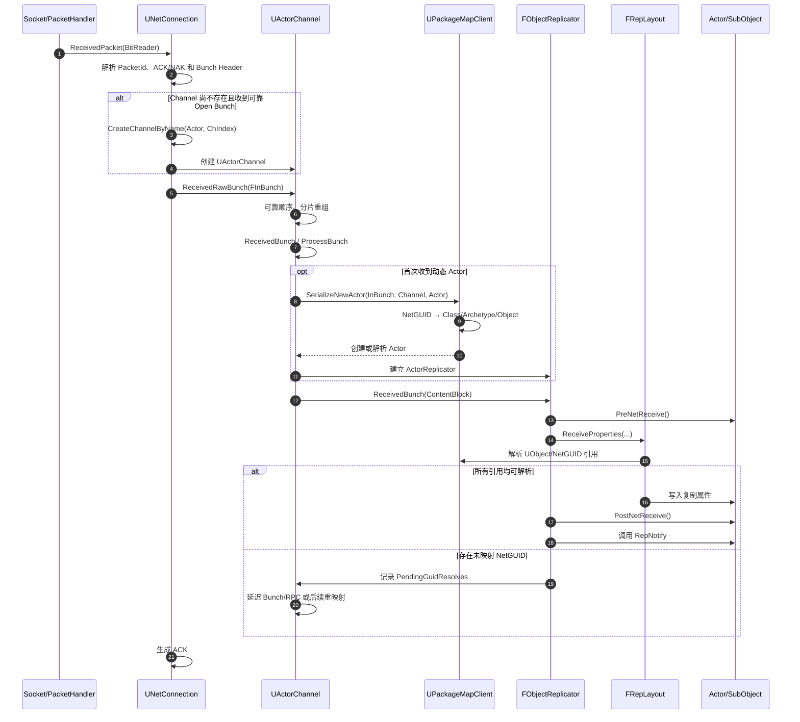
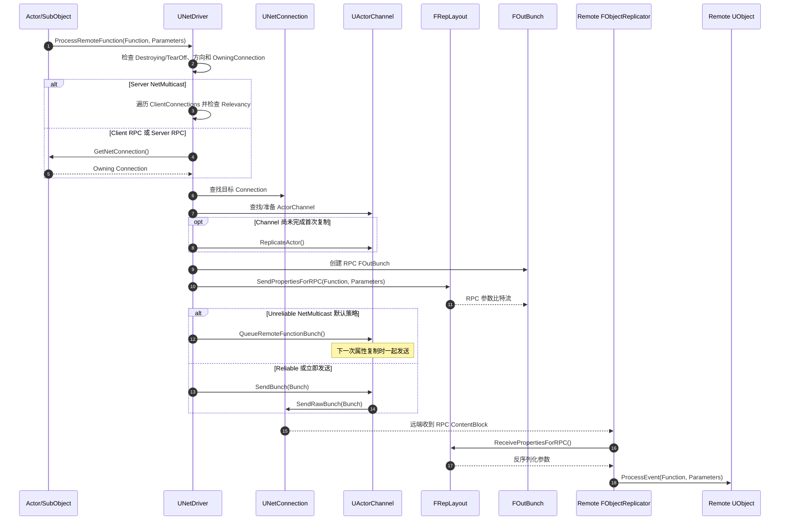
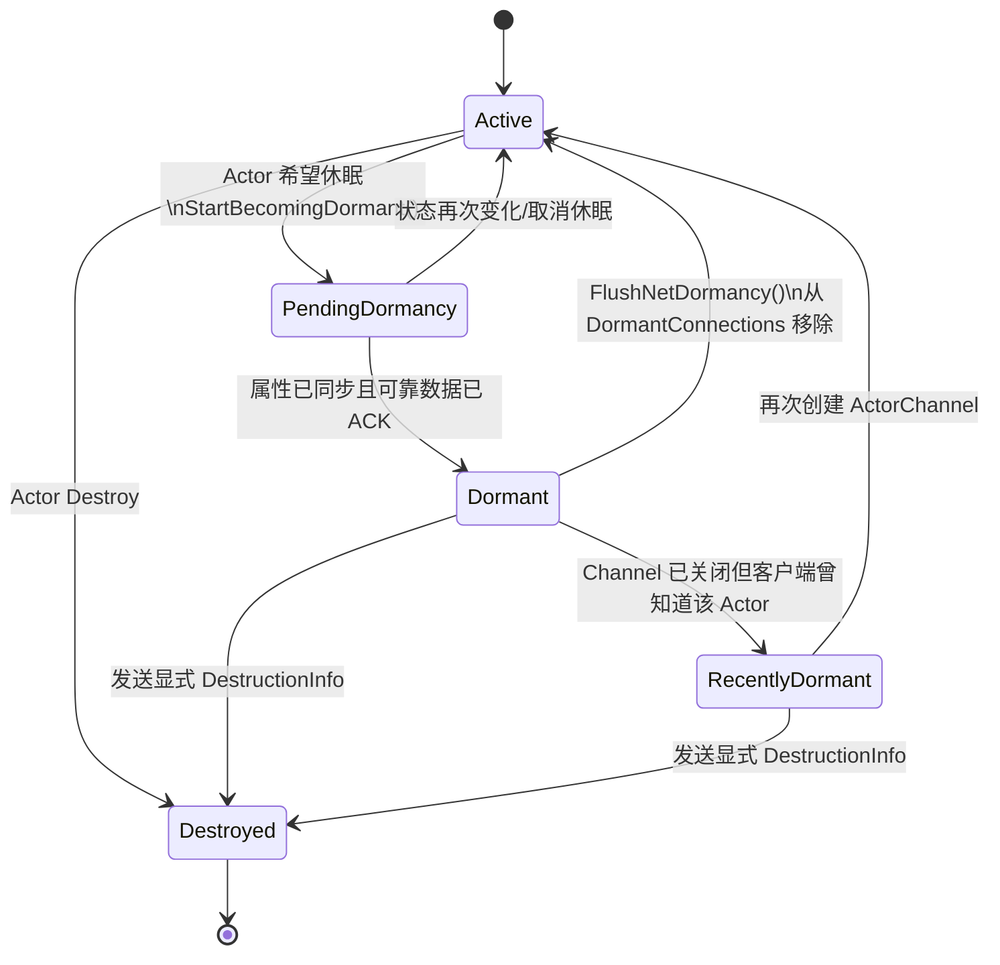

# Unreal Engine Legacy 网络同步

本文整理 Unreal Engine `UNetDriver` 的通用 Legacy Actor 复制路径，重点描述服务端属性同步、客户端接收、RPC、相关性、优先级和休眠之间的关系。

## 1. 范围

本文讨论以下条件下的通用复制实现：

```cpp
ReplicationSystem == nullptr; // 未使用 Iris
ReplicationDriver == nullptr; // 未使用 ReplicationGraph 等自定义 ReplicationDriver
```

ReplicationGraph 仍然复用 `UNetConnection`、`UActorChannel`、`FObjectReplicator` 和 Bunch/Packet 传输层，但它会接管 `ServerReplicateActors()` 中的 Actor 收集、过滤和调度。因此，本文的“ConsiderList → Priority → ActorChannel”流程特指 `UNetDriver` 自带的通用 Legacy 实现。

## 2. 一帧同步的分层

```text
Actor 调度层
UNetDriver + FNetworkObjectList + FNetworkObjectInfo + FActorPriority
        │
        ▼
每连接复制层
UNetConnection + UActorChannel
        │
        ▼
对象属性复制层
FObjectReplicator + FRepLayout + RepState/Changelist
        │
        ▼
对象引用层
UPackageMapClient + FNetGUIDCache
        │
        ▼
传输层
FOutBunch/FInBunch → Packet → LowLevelSend/Receive
```

核心原则：

- `UNetDriver` 决定本帧哪些 Actor 值得检查。
- 每个 `UNetConnection` 都有独立的相关性、优先级、Channel 和发送状态。
- 一个 Actor 对一个连接通常对应一个 `UActorChannel`。
- 一个 Channel 内含 Actor 自身及其 SubObject 的 `FObjectReplicator`。
- `FRepLayout` 描述“如何比较和序列化这个类的复制属性”。
- `UPackageMapClient/FNetGUIDCache` 负责 UObject 与网络标识之间的映射。
- `FOutBunch` 是 Channel 级逻辑消息，Packet 是 Connection 级实际发送单元。

## 3. 核心类图

```mermaid
classDiagram
direction LR

class AActor {
    +NetUpdateFrequency
    +MinNetUpdateFrequency
    +NetDormancy
    +bOnlyRelevantToOwner
    +CallPreReplication(NetDriver)
    +IsNetRelevantFor(Viewer, ViewTarget, Location) bool
    +ReplicateSubobjects(Channel, Bunch, Flags) bool
}

class UNetDriver {
    +ClientConnections
    +ReplicationFrame
    +TickFlush(DeltaSeconds)
    +ServerReplicateActors(DeltaSeconds) int
    +ServerReplicateActors_BuildConsiderList()
    +ServerReplicateActors_PrioritizeActors()
    +ServerReplicateActors_ProcessPrioritizedActorsRange()
    +ProcessRemoteFunction()
}

class FNetworkObjectList {
    +FindOrAdd(Actor)
    +Remove(Actor)
    +MarkDormant(Actor, Connection)
    +MarkActive(Actor, Connection)
    +GetActiveObjects()
}

class FNetworkObjectInfo {
    +Actor
    +NextUpdateTime
    +LastNetReplicateTime
    +OptimalNetUpdateDelta
    +DormantConnections
    +RecentlyDormantConnections
    +bPendingNetUpdate
    +ForceRelevantFrame
}

class FActorPriority {
    +ActorInfo
    +Channel
    +DestructionInfo
    +Priority
}

class UNetConnection {
    +Driver
    +PackageMap
    +OpenChannels
    +ActorChannels
    +ViewTarget
    +IsNetReady() bool
    +CreateChannelByName() UChannel
    +SendRawBunch(Bunch) int
    +ReceivedPacket(Reader)
}

class UChannel {
    +Connection
    +ChIndex
    +SendBunch(Bunch) PacketIdRange
    +ReceivedRawBunch(Bunch)
}

class UActorChannel {
    +Actor
    +ActorReplicator
    +ReplicationMap
    +RelevantTime
    +LastUpdateTime
    +ReplicateActor() int64
    +ReceivedBunch(Bunch)
    +ProcessBunch(Bunch)
    +StartBecomingDormant()
}

class FObjectReplicator {
    +Object
    +Connection
    +OwningChannel
    +RepLayout
    +RepState
    +ChangelistMgr
    +ReplicateProperties(Bunch, Flags) bool
    +ReceivedBunch(Bunch, Flags) bool
    +PostSendBunch(PacketRange, Reliable)
    +CallRepNotifies()
}

class FRepLayout {
    +CreateFromClass(Class)
    +CreateRepState()
    +CreateReplicationChangelistMgr()
    +ReplicateProperties(...)
    +ReceiveProperties(...)
    +SendPropertiesForRPC(...)
    +ReceivePropertiesForRPC(...)
}

class FReplicationChangelistMgr {
    +RepChangelistState
}

class FRepState {
    +SendingRepState
    +ReceivingRepState
}

class UPackageMapClient {
    +SerializeNewActor(Bunch, Channel, Actor)
    +SerializeObject(...)
}

class FNetGUIDCache {
    +GetOrAssignNetGUID(Object)
    +GetObjectFromNetGUID(Guid)
}

class FOutBunch {
    +ChIndex
    +bReliable
    +bOpen
    +bClose
    +PacketId
}

class FInBunch {
    +ChIndex
    +bReliable
    +bOpen
    +bClose
}

UNetDriver *-- FNetworkObjectList : owns
FNetworkObjectList *-- "0..*" FNetworkObjectInfo : tracks
FNetworkObjectInfo --> AActor : actor
FNetworkObjectInfo --> "0..*" UNetConnection : dormancy per connection

UNetDriver o-- "0..*" UNetConnection : clients
UNetDriver ..> FActorPriority : builds per connection
FActorPriority --> FNetworkObjectInfo
FActorPriority --> UActorChannel

UNetConnection *-- "0..*" UChannel : channels
UChannel <|-- UActorChannel
UActorChannel --> AActor
UActorChannel *-- "1" FObjectReplicator : actor replicator
UActorChannel *-- "0..*" FObjectReplicator : subobject replicators

FObjectReplicator --> FRepLayout
FObjectReplicator *-- FRepState
FObjectReplicator --> FReplicationChangelistMgr

UNetConnection *-- UPackageMapClient
UPackageMapClient --> FNetGUIDCache
UActorChannel ..> UPackageMapClient : spawn/object references

UChannel ..> FOutBunch : sends
UNetConnection ..> FOutBunch : packs
UNetConnection ..> FInBunch : parses
UActorChannel ..> FInBunch : receives
```



### 3.1 关键所有权

| 对象 | 所有者/缓存位置 | 粒度 |
|---|---|---|
| `FNetworkObjectInfo` | `FNetworkObjectList` | 每 NetDriver、每 Actor |
| `UNetConnection` | `UNetDriver` | 每远端连接 |
| `UActorChannel` | `UNetConnection` | 每连接、每相关 Actor |
| `FObjectReplicator` | `UActorChannel` | 每连接、每 Actor/SubObject |
| `FRepLayout` | `UNetDriver::RepLayoutMap` 共享缓存 | 每类型/函数 |
| `FRepState` | `FObjectReplicator` | 每连接、每对象 |
| `FReplicationChangelistMgr` | NetDriver 缓存并由 Replicator 引用 | 每复制对象 |
| `UPackageMapClient` | `UNetConnection` | 每连接 |

这里最容易混淆的是：

- `FRepLayout` 可以跨连接共享，因为它描述类型的静态复制布局。
- `FRepState` 不能跨连接共享，因为不同客户端收到和 ACK 的状态不同。
- Changelist 的属性比较结果可以被多个连接复用，但最终条件过滤和发送历史仍然是每连接状态。

## 4. 服务端属性同步时序图

```mermaid
sequenceDiagram
autonumber
participant World as UWorld
participant Driver as UNetDriver
participant ObjList as FNetworkObjectList
participant Actor as AActor
participant Conn as UNetConnection
participant Channel as UActorChannel
participant PkgMap as UPackageMapClient
participant Replicator as FObjectReplicator
participant Layout as FRepLayout
participant Bunch as FOutBunch
participant Transport as Packet/Socket

World->>Driver: InternalTickFlush(DeltaSeconds)
Driver->>Driver: TickFlush()
Driver->>Driver: ServerReplicateActors()

Driver->>Conn: PrepConnections()
Conn-->>Driver: ViewTarget / ready state

Driver->>ObjList: GetActiveObjects()
loop 每个活跃 Actor
    ObjList-->>Driver: FNetworkObjectInfo
    Driver->>Driver: 检查 NextUpdateTime、初始化、Level、Dormancy
    Driver->>Actor: CallPreReplication(Driver)
    Driver->>Driver: 加入全局 ConsiderList
end

loop 每个可更新 Connection
    Driver->>Driver: 构造 FNetViewer
    loop ConsiderList
        Driver->>Actor: IsNetRelevantFor(...)
        Driver->>Driver: 检查 Owner、Level、Dormancy
        Driver->>Driver: 构造 FActorPriority
    end
    Driver->>Driver: 按 Priority 降序排序

    loop 按优先级处理 Actor
        Driver->>Conn: IsNetReady()
        alt 不存在 ActorChannel 且 Actor Relevant
            Driver->>Conn: CreateChannelByName(Actor)
            Conn-->>Driver: UActorChannel
            Driver->>Channel: SetChannelActor(Actor)
        end

        Driver->>Channel: ReplicateActor()
        Channel->>Bunch: 创建 FOutBunch

        opt 首次复制
            Channel->>PkgMap: SerializeNewActor(Bunch, Channel, Actor)
            PkgMap->>PkgMap: 分配/导出 NetGUID
        end

        Channel->>Replicator: ReplicateProperties(Bunch, RepFlags)
        Replicator->>Layout: Update changelist
        Replicator->>Layout: ReplicateProperties(...)
        Layout-->>Replicator: 属性比特流
        Replicator->>Channel: WriteContentBlockPayload()

        opt 存在 SubObject
            Channel->>Replicator: 复制各 SubObject 属性
        end

        alt 写入了属性、RPC、Spawn 或删除信息
            Channel->>Channel: SendBunch(Bunch)
            Channel->>Conn: SendRawBunch(Bunch)
            Conn->>Transport: 合并到 Packet 并 LowLevelSend
            Channel->>Replicator: PostSendBunch(PacketIdRange)
        else 没有任何变化
            Channel-->>Driver: 0 bits，不发送 Bunch
        end
    end
end
```

### 4.1 全局筛选与每连接筛选

`BuildConsiderList()` 是全局筛选，只执行一次：

```text
Active Actor
  → 是否到 NextUpdateTime
  → Actor 是否有效且初始化
  → 是否属于当前 NetDriver
  → Level 是否稳定
  → 是否为 DORM_Initial
  → PreReplication
  → ConsiderList
```

随后每个连接独立执行：

```text
ConsiderList
  → 客户端是否加载对应 Level
  → Owner 相关性
  → IsNetRelevantFor
  → 该连接上是否 Dormant
  → FActorPriority 排序
  → 在带宽允许范围内依次复制
```

因此：

- `NetUpdateFrequency` 控制 Actor 多久进入一次全局 ConsiderList。
- Relevancy 决定 Actor 是否应发送给某个具体连接。
- Priority 决定带宽不足时谁先发送。
- Dormancy 决定是否可以长期跳过属性比较。

## 5. 客户端接收属性时序图



客户端不会运行服务端的 ConsiderList、Relevancy 或 Priority。客户端只处理服务端已经选择并发送过来的 Channel/Bunch。

## 6. Legacy RPC 时序图



重要行为：

- Reliable RPC 缓冲区溢出被视为不可恢复错误，连接会被关闭。
- 默认情况下 Unreliable Multicast 会进入 ActorChannel 队列，与下一次属性更新一起发送。
- RPC 可能强制 Actor 先完成首次 Channel 复制，否则远端无法识别 RPC 的目标对象。
- RPC 的参数同样通过 `FRepLayout` 序列化。

## 7. Dormancy 状态图



休眠不是简单地把 `Actor->NetDormancy` 改成某个值：

1. ActorChannel 先进入 Pending Dormancy。
2. 最终属性和 Reliable 数据全部被确认后，才算对该连接完全 Dormant。
3. `FNetworkObjectInfo::DormantConnections` 按连接记录休眠状态。
4. Actor 对所有连接都 Dormant 后，可以从 ActiveObjects 中移出。
5. `FlushNetDormancy()` 会让已连接客户端重新考虑该 Actor，但不永久修改 Actor 的目标 Dormancy 状态。

## 8. 关键数据状态

### `FNetworkObjectInfo`

负责 Actor 调度：

| 字段 | 作用 |
|---|---|
| `NextUpdateTime` | 下一次进入 ConsiderList 的时间 |
| `LastNetReplicateTime` | 最近真正发送属性的时间 |
| `OptimalNetUpdateDelta` | 自适应更新频率计算结果 |
| `bPendingNetUpdate` | 上一帧因饱和等原因未完成，下一帧重试 |
| `DormantConnections` | Actor 已在哪些连接上完全休眠 |
| `RecentlyDormantConnections` | Channel 已关闭，但客户端曾经知道该 Actor |
| `ForceRelevantFrame` | 强制至少一次相关 |

### `UActorChannel`

负责 Actor 在单个连接上的生命周期：

| 字段 | 作用 |
|---|---|
| `Actor` | Channel 对应的 Actor |
| `ActorReplicator` | Actor 自身的属性复制器 |
| `ReplicationMap` | Actor 与 SubObject 的 Replicator |
| `RelevantTime` | 相关性滞后时间，避免频繁开关 Channel |
| `LastUpdateTime` | 最近一次完成属性检查的时间 |
| `OpenPacketId` | 首次打开 Channel 的 Packet 范围 |
| `PendingGuidResolves` | 当前阻塞处理的未映射对象引用 |

### `FObjectReplicator`

负责一个具体 UObject 对一个具体连接的同步：

```text
UObject 当前值
  + FRepLayout 静态布局
  + FReplicationChangelistMgr 变化列表
  + FSendingRepState 该连接发送历史
  + FReceivingRepState 客户端接收/RepNotify 状态
  = 本次需要写入或读取的属性数据
```

## 9. Bunch、Packet、Reliable 的关系

```text
复制属性/RPC
    ↓
FOutBunch（属于某个 Channel）
    ↓ 可分片、可与相邻 Bunch 合并
UNetConnection::SendRawBunch
    ↓
Packet（包含 PacketId、ACK/NAK、一个或多个 Bunch）
    ↓
PacketHandler / LowLevelSend
```

- Channel 负责逻辑消息顺序。
- Connection 负责 Packet、ACK/NAK、带宽和实际发送缓冲。
- Reliable 的可靠性建立在 Bunch 序号、Packet ACK/NAK 和重发状态之上。
- 属性更新不等同于全部 Reliable；属性发送历史会结合 ACK/NAK 决定哪些变化需要再次发送。
- Actor 初次创建、Channel Open/Close 和部分关键控制信息通常需要 Reliable。

## 10. 源码阅读入口

建议按以下顺序阅读：

1. [`UNetDriver::TickFlush`](../../../../GitHub/UnrealEngine/Engine/Source/Runtime/Engine/Private/NetDriver.cpp)
2. `UNetDriver::ServerReplicateActors`
3. `ServerReplicateActors_BuildConsiderList`
4. `ServerReplicateActors_PrioritizeActors`
5. `ServerReplicateActors_ProcessPrioritizedActorsRange`
6. [`UActorChannel::ReplicateActor`](../../../../GitHub/UnrealEngine/Engine/Source/Runtime/Engine/Private/DataChannel.cpp)
7. [`FObjectReplicator::ReplicateProperties`](../../../../GitHub/UnrealEngine/Engine/Source/Runtime/Engine/Private/DataReplication.cpp)
8. [`FRepLayout::ReplicateProperties`](../../../../GitHub/UnrealEngine/Engine/Source/Runtime/Engine/Private/RepLayout.cpp)
9. [`UChannel::SendBunch`](../../../../GitHub/UnrealEngine/Engine/Source/Runtime/Engine/Private/DataChannel.cpp)
10. [`UNetConnection::SendRawBunch`](../../../../GitHub/UnrealEngine/Engine/Source/Runtime/Engine/Private/NetConnection.cpp)
11. `UNetConnection::ReceivedPacket`
12. `UActorChannel::ProcessBunch`
13. `FObjectReplicator::ReceivedBunch`

对应的核心头文件：

- `Engine/Classes/Engine/NetDriver.h`
- `Engine/Classes/Engine/NetworkObjectList.h`
- `Engine/Classes/Engine/NetConnection.h`
- `Engine/Classes/Engine/ActorChannel.h`
- `Engine/Public/Net/DataReplication.h`
- `Engine/Public/Net/RepLayout.h`
- `Engine/Classes/Engine/PackageMapClient.h`

## 11. 总结

Legacy 同步不是“遍历所有 Actor 并把属性发出去”，而是一条多阶段管线：

```text
更新频率筛选
→ 每连接相关性过滤
→ Dormancy 过滤
→ 优先级排序
→ 带宽裁剪
→ ActorChannel 生命周期
→ ObjectReplicator 属性差异比较
→ RepLayout 序列化
→ PackageMap/NetGUID 对象映射
→ Bunch/Packet 可靠传输
→ 客户端反序列化与 RepNotify
```

性能问题也应按这一分层定位：

- ConsiderList 过大：检查 `NetUpdateFrequency`、Dormancy 和 Actor 注册数量。
- 每连接 Priority 开销大：检查 Relevancy、连接数量和 ReplicationGraph 的使用必要性。
- 属性比较开销大：检查 Push Model、RepLayout 和频繁变化属性。
- 带宽饱和：检查 Priority、属性大小、RPC 频率和 Channel 数量。
- 客户端卡顿：检查大 Bunch、未映射 NetGUID、异步加载及 RepNotify 工作量。
